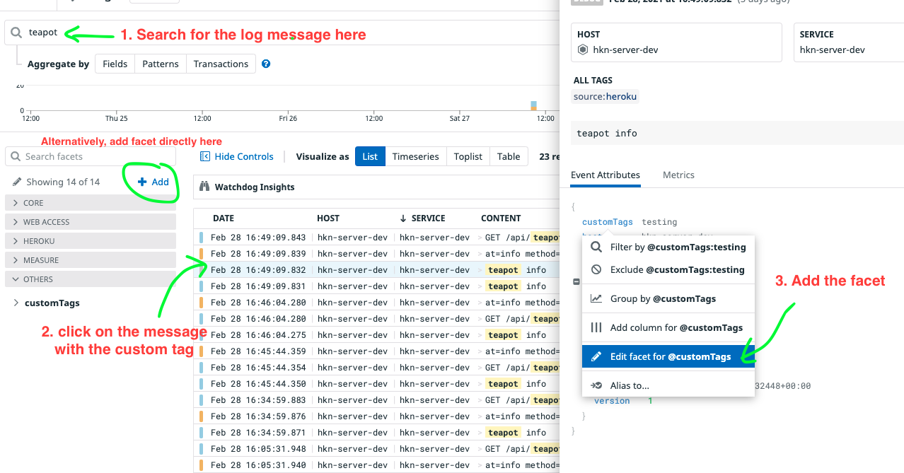

# How To Add Logs using the logger

## Environmental Variables:

- For local development, in backend/.env, set the environmental variable "MAX_LOG_LEVEL" to the desired value for the max level of log to show. i.e.
  "MAX_LOG_LEVEL=debug" to show all 4 levels
- For heroku deployment, got to Settings -> Config Vars, and similarly set the MAX_LOG_LEVEL.

## Step-by-step Guide:

To use the logger, first import it:

```
import logger from '@Logger';
```

Then to use it, do

```javascript
logger.log({
  level: 'debug',
  message: 'teapot info',
  customTags1: 'tag1 label',
  customTags2: 'tag2 label',
});
```

The level can be one of the four levels specified in logging.ts, error, warn, info, debug (ordered from most severe to least severe). Message is the message we
want to log. CustomTags can be added for filtering in datadog. Multiple tags can be added as shown in the example.

## Datadog Guide:

To filter by custom tags, we need to add a facet. The easiest way I found is to first serach for the log message that got logged.


Note that the tag would not be indexed if the facet is created after the log is processed, which means if we add a facet after the message gots logged, the
message can't be filtered using the tag, but future messages with the tag can be filtered.

After that we would be able to filter by selecting the tags we want.
